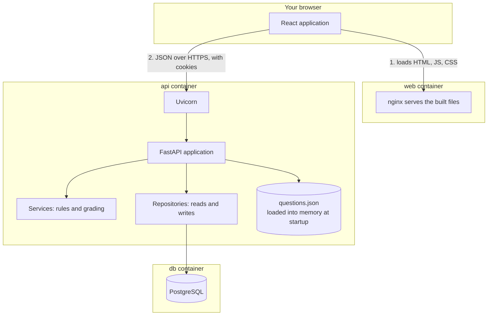
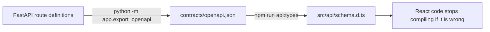

# How this application is put together

A guide to the architecture and to every tool in the stack: what each one is, what problem it
solves, and where it actually appears in this repository.

This document is for reading, not for reference. It moves from the shape of the whole system,
to one request traced end to end, to a catalogue of the tools, to a glossary of the concepts
behind them. If a term is unfamiliar, it is probably explained in
[Concepts worth knowing](#concepts-worth-knowing) at the end.

---

## 1. The short version

The application is three running programs and one shared agreement between them.

| Piece | What it does | What it is built with |
|---|---|---|
| **Web** | Draws the interface in the browser and reacts to clicks | React, TypeScript, served as static files by nginx |
| **API** | Owns all the rules: grades answers, tracks progress, decides who you are | Python, FastAPI, running under Uvicorn |
| **Database** | Remembers accounts, progress, and sessions between visits | PostgreSQL |
| **The contract** | The written agreement about what the API accepts and returns | `contracts/openapi.json` |

The interesting design choice is the last row. The API *generates* the contract from its own
code, and the frontend *generates* its TypeScript types from that contract. Neither side
describes the other by hand, so they cannot quietly disagree.

---

## 2. The big picture



Two things to notice.

**The browser talks to the API directly**, not through nginx. nginx only hands over the HTML,
JavaScript, and CSS files once; after that, every question, answer, and statistic travels
between the React application and the API as JSON. That is why the API has to be configured to
accept requests from the web container's origin, which is what CORS is about.

**The question bank is not in the database.** `questions.json` is read once when the API starts
and held in memory. The database stores only things that belong to a learner: accounts,
progress, sessions, and answers. The reasoning is recorded in
`contracts/adr/0003-question-bank-stays-in-json.md`.

---

## 3. One request, traced all the way through

This is the most useful thing in this document. Follow a single click — pressing **Submit
answer** — and nearly every tool in the stack shows up in order.

### In the browser

**1. A click handler runs.** `frontend/src/pages/SessionPage.tsx` holds which letter you
selected in React state. Clicking the button calls:

```tsx
submitAnswer.mutate(chosen, { onSuccess: setAnswer })
```

**2. TanStack Query takes over.** `submitAnswer` came from `useSubmitAnswer()` in
`frontend/src/api/hooks.ts`. It is a *mutation*: a request that changes something on the
server. TanStack Query tracks whether it is in flight, whether it failed, and what to refresh
afterwards, so no component has to manage loading flags by hand.

**3. The typed client builds the request.** Inside that hook:

```ts
await api.POST('/api/sessions/{session_id}/answer', {
  params: { path: { session_id: sessionId } },
  body: { choice },
})
```

`api` is an `openapi-fetch` client created in `frontend/src/api/client.ts`. It is typed against
`frontend/src/api/schema.d.ts`, which was generated from the contract. Misspell the path, pass
the wrong field name, or send a letter the API does not accept, and this line stops compiling.

**4. The CSRF middleware attaches proof.** Still in `client.ts`, a middleware runs on every
request that is not a GET. It reads the `sp_csrf` cookie — which is deliberately readable by
JavaScript — and copies it into the `X-CSRF-Token` header.

**5. The browser attaches the session automatically.** The client is created with
`credentials: 'include'`, so the browser sends the `sp_session` cookie. That cookie is
`HttpOnly`, meaning JavaScript cannot read it; only the browser can send it. Nothing in the
application code ever touches it.

### Crossing the network

**6. CORS is checked.** The page is served from `http://localhost:5173` but the request goes to
`http://localhost:8000`. Those are different origins, so the browser refuses by default. The
API opts in explicitly in `backend/app/main.py`:

```python
app.add_middleware(
    CORSMiddleware,
    allow_origins=settings.cors_origins,
    allow_credentials=True,
    allow_methods=["GET", "POST", "PATCH", "DELETE"],
    allow_headers=["Content-Type", "X-CSRF-Token"],
)
```

Note `allow_credentials=True` and the explicit header. Without both, the cookie or the CSRF
token would be stripped and the request would fail.

### Inside the API

**7. Uvicorn accepts the connection** and hands it to FastAPI. Uvicorn is the actual server
process; FastAPI is the framework that decides what to do with the request.

**8. FastAPI matches the route** to `submit_answer` in
`backend/app/api/routes/sessions.py`, then resolves its dependencies before the function body
runs:

```python
def submit_answer(
    session_id: uuid.UUID,
    payload: AnswerRequest,
    context: CsrfProtected,
    db: DbSession,
    bank: Bank,
) -> AnswerResponse:
```

Each parameter is filled in for you. This is *dependency injection*:

- `session_id` is parsed out of the URL and validated as a UUID.
- `payload` is the JSON body, validated by Pydantic against `AnswerRequest`, which permits only
  `a`, `b`, `c`, `d`, or `null` for a skip. A bad value is rejected with a 422 before your code
  sees it.
- `context` runs the whole authentication chain (below).
- `db` opens a database session for this request and closes it afterwards.
- `bank` hands over the in-memory question bank.

**9. Authentication and CSRF are verified.** `CsrfProtected` chains through
`backend/app/api/deps.py`: read the `sp_session` cookie, compute an HMAC-SHA256 digest of it
keyed by `SECRET_KEY`, look up that digest in the `auth_sessions` table, load the user, then
compare the submitted `X-CSRF-Token` against the token stored on that session row.

Only the digest is stored, so somebody who steals a copy of the database still cannot forge a
session cookie. And the CSRF value is compared against the *server's* record, not against
another cookie, which is what makes the double-submit pattern meaningful.

**10. Authorization is applied.** `_load_session` fetches the study session **filtered by
`user_id`**. Asking for someone else's session returns 404, not their data. This is the
difference between authentication ("who are you") and authorization ("may you have this").

**11. The rules run, with no database involved.** `grade_answer()` in
`backend/app/services/study_session.py` is a pure function. It maps the letter you saw back to
the letter the question really uses — necessary because choices get shuffled — and decides
correct, incorrect, or skipped. Because it touches nothing external, it is tested directly,
with no database and no HTTP.

**12. The results are written down.** Two repository calls record the attempt against your
cumulative progress and against this session, and advance the session's position. Repositories
are the only modules that talk to the database.

**13. The response is built.** `AnswerResponse` is the *first* moment the correct answer and
its explanation are sent to the browser. No browsing endpoint returns them, which is why the
answer key cannot be scraped ahead of time.

**14. Security headers are added** by `SecurityHeadersMiddleware` on the way out.

### Back in the browser

**15. The response is unwrapped.** `unwrap()` in `frontend/src/api/errors.ts` either returns
the data or throws an `ApiError` carrying a message the interface can show a person.

**16. Caches are invalidated.** The mutation's `onSuccess` tells TanStack Query that progress
and the review guide are now stale. Any screen showing them refetches when it is next viewed —
you never write that plumbing per screen.

**17. React re-renders.** `setAnswer(...)` updates state, and React works out the minimum
change to the page: the feedback panel appears, the correct choice turns green, the choices
become disabled. You describe what the screen should look like for a given state; React does
the DOM surgery.

That single click involved eleven of the tools below. Everything else in this document is
detail on the pieces you just walked past.

---

## 4. The backend, layer by layer

```
backend/app/
  main.py            Builds the app, adds middleware, wires the routes together
  core/              Settings, logging, security headers, hashing, rate limiting, clock
  models/            Domain models: what a question, a progress record, a review guide are
  services/          The rules: question bank, statistics, review guide, session behaviour
  repositories/      Database reads and writes, one module per kind of thing
  db/                Table definitions and connection handling
  api/               Routes, request/response schemas, dependencies, cookie handling
  export_openapi.py  Writes contracts/openapi.json
alembic/             Database migrations
tests/unit/          Rules, services, repositories
tests/api/           Real HTTP behaviour, including auth and response hardening
```

The layering rule is worth stating plainly, because it is the reason the code is testable:

> Routes may use services and repositories. **Services never import repositories.**

So the rules about how a study session behaves ("pick these questions", "this answer is
correct", "this subject is your weakest") can be tested by calling a function with plain
Python values. No database, no server, no fixtures. The database only enters at the edges.

Two supporting ideas:

**Domain models vs API schemas.** `app/models/` describes what things *are* internally.
`app/api/schemas.py` describes what the API *sends and receives*. Keeping them separate means
an internal refactor cannot accidentally change the public contract, and a field you add
internally is not published to the world by default.

**The application factory.** `create_app()` builds and returns the app rather than configuring
one global object. Tests can build an app with different settings, which is how the test suite
runs against SQLite while production runs against PostgreSQL.

---

## 5. The frontend, layer by layer

```
frontend/src/
  api/          Generated schema, typed client, query hooks, error translation
  auth/         Who is signed in, and the guard that redirects when nobody is
  components/   Reusable pieces: buttons, cards, form fields, loading and error states
  pages/        One file per screen, each with a sibling .test.tsx
  test/         Fake API handlers, fixtures, and a render helper
  App.tsx       The route table
  main.tsx      Start-up: mounts React, creates the query client
```

The mental model that makes React click:

**You describe, React updates.** You never write "find that element and change its colour". You
write a function that returns what the screen should look like *given the current state*, and
React computes the difference. `SessionPage.tsx` says: if there is an answer, show feedback; if
not, show the submit button. Both branches are always in the code; the state decides which one
is real.

**Two kinds of state, handled differently.** Which radio button you clicked is *UI state* and
lives in `useState`. Your progress statistics are *server state* — a cached copy of something
that lives elsewhere and can go stale — and live in TanStack Query. Conflating these is the
usual source of tangled frontend code.

**Everything goes through one door.** No component calls `fetch` directly. All of it flows
through `api/hooks.ts` → `api/client.ts`, which is why CSRF handling, cookie handling, and
error translation are each written exactly once.

### The screens

| Route | What it does |
|---|---|
| `/` | **Dashboard** — progress stats, accuracy by domain, weakest subjects. Domain and subject rows link into the review guide with that filter already applied. |
| `/study` | **Start a session** — choose a study mode. For missed questions, pick either every question you have ever gotten wrong or only those not yet answered correctly (`missed_scope`). |
| `/sessions/:id` | **Answer questions** — keyboard shortcuts: `a`–`d` to select, Enter to submit and advance. |
| `/sessions/:id/summary` | **Session summary** — how the session went. |
| `/review-guide` | **Review guide** — weak areas ranked by domain, filterable by domain or subject via the page or URL query (`?domain=…`, `?subject=…`). |

The nav bar shows Dashboard, Study, and Review guide. There is no separate question-browse
screen; the API still exposes `/api/questions` for programmatic use, but answers never appear
there.

**Two numbers on the dashboard mean different things.** The **Missed** stat at the top counts
every wrong *attempt*. The **to revisit** count at the bottom counts unique *questions* you
have gotten wrong at least once — the set used for missed-question study sessions.

---

## 6. The tools, one at a time

### Backend runtime

**Python 3.12** — the language. 3.12 specifically for modern typing syntax used throughout.

**FastAPI** — the web framework. It turns Python functions into HTTP endpoints. Its unusual
strength is that it reads your type annotations: writing `payload: AnswerRequest` gives you
request parsing, validation, error responses, and a documentation entry, all from the
annotation. It is also what generates `contracts/openapi.json`, which the entire contract-first
setup depends on. *Without it:* you would hand-write parsing, validation, and API docs, and the
docs would drift.

**Uvicorn** — the server that actually listens on a port and speaks HTTP, handing requests to
FastAPI. FastAPI is a framework, not a server; you need both. *Without it:* nothing to run.

**Pydantic** — validation and serialization. You declare the shape of data as a class, and
Pydantic enforces it at runtime and converts to and from JSON. It is the reason a malformed
request gets a precise 422 instead of a stack trace. Used in `app/models/` and
`app/api/schemas.py`.

**pydantic-settings** — the same idea applied to configuration. `app/core/config.py` declares
every environment variable with a type and a default, validated at start-up. It is also where
the application refuses to boot in production with the development `SECRET_KEY` — a
misconfiguration fails loudly rather than running insecurely.

**SQLModel** — defines database tables as Python classes (`app/db/tables.py`) and is a thin
layer over SQLAlchemy, sharing its class definitions with Pydantic. This is the *ORM*: you work
with objects, it writes the SQL. That also means queries are parameterized automatically, which
removes the whole SQL-injection category.

**SQLAlchemy** — the engine underneath SQLModel; it builds the SQL, manages connections, and
handles transactions. You see it directly in a few places, such as the timezone-aware
`DateTime` columns.

**psycopg** — the PostgreSQL driver: the code that actually speaks Postgres's wire protocol.
SQLAlchemy uses it as its transport.

**Alembic** — migrations. Your table classes describe what the schema *should* be; Alembic
generates and applies ordered scripts that move a real database from its current shape to that
one, and back. It exists because a live database has data in it and cannot simply be recreated.
`alembic check` fails when the classes and the migrations disagree, and CI also runs
`downgrade base`, so a migration without a working reverse path fails the build.

**argon2-cffi** — password hashing, using Argon2id, a deliberately slow and memory-hard
algorithm. Slow is the point: it makes guessing billions of passwords expensive. It also
supports transparent rehashing, so cost parameters can be raised later without resetting
anyone's password. Hashing is one-way and is *not* encryption — see the glossary.

### Backend development tools

**pytest** — the test framework. 167 tests here. `tests/unit/` covers rules and services
directly; `tests/api/` drives the real HTTP surface.

**pytest-cov** — measures which lines the tests execute. Configured in `pyproject.toml` to fail
under 85%. Coverage is a floor against untested code sneaking in, not proof of correctness.

**httpx** — the HTTP client FastAPI's test client uses to call the app in-process, so API tests
run without starting a server.

**Ruff** — linter and formatter, in Rust, extremely fast. It replaces what used to be four
tools (flake8, isort, black, and parts of bandit). The `select` list in `pyproject.toml` picks
the rule families, including `S` for the bandit security checks. *Without it:* inconsistent
formatting and style arguments in code review.

**mypy** — static type checking, in `strict` mode. Python does not enforce annotations at
runtime; mypy checks them before the code runs, catching "this can be `None` here" bugs.

**pre-commit** — runs Ruff and mypy automatically when you commit, so problems surface locally
instead of in CI ten minutes later. Install once with `pre-commit install`.

**pip-audit** — checks installed dependencies against known-vulnerability databases and fails
the build on a match. Supply chain security: most of the code shipped is not yours.

### Frontend runtime

**React 19** — the interface library. Components are functions that return markup; state
changes cause re-renders. See the mental model in section 5.

**TypeScript** — JavaScript with type checking, in `strict` mode. This is what makes the
generated API types worth having: a renamed backend field becomes a compile error rather than
`undefined` on screen. Pinned to 5.9 because `openapi-typescript` does not support 6.x yet —
recorded in ADR 0005.

**Vite** — the build tool. In development it serves your source with instant hot reloading; for
production it bundles, minifies, and hashes filenames into `dist/`. It is also what makes
`import.meta.env.VITE_API_URL` work, inlining that value at build time.

**React Router** — maps URLs to screens (`App.tsx`) and gives you `<Link>` navigation without
full page reloads. Also the reason nginx needs the `try_files ... /index.html` fallback: the
server has no `/review-guide` file, the application handles that path itself.

**TanStack Query** — server-state management: caching, loading and error states,
deduplication, and refreshing stale data. `useQuery` reads; `useMutation` writes. When an
answer is submitted, one line marks progress as stale and every affected screen updates itself.
*Without it:* `useEffect` and manual loading flags in every component, and stale screens after
writes.

**Tailwind CSS 4** — styling with utility classes written directly on elements
(`rounded-lg px-4 py-2`) instead of a separate stylesheet with invented class names. The build
step emits only the classes actually used. The trade-off is dense markup in exchange for never
hunting for which CSS rule applies.

**openapi-fetch** — a tiny typed wrapper over `fetch`. It checks paths, parameters, and bodies
against the generated types, and provides the middleware hook where CSRF handling lives.

### Frontend development tools

**openapi-typescript** — reads `contracts/openapi.json` and writes
`frontend/src/api/schema.d.ts`. This single command is the whole contract-first arrangement:

```bash
npm run api:types
```

**Vitest** — the test runner, sharing Vite's configuration so tests see the same setup as the
application. 76 tests here.

**Testing Library** — utilities for testing components the way a person uses them: find the
button *by its visible label*, click it, assert on what appears. Tests written this way survive
refactors and implicitly check accessibility, because an element with no accessible name cannot
be found by the test either.

**MSW (Mock Service Worker)** — intercepts network requests and answers with fixtures, so tests
exercise the real client, real cache, and real error handling without a live backend. It is
configured to *fail* on any request it was not told about, so a test cannot accidentally depend
on something undeclared. Handlers live in `src/test/server.ts`.

**jsdom** — a simulated browser environment in Node, so tests have a DOM, cookies, and events
without launching a real browser.

**oxlint** — the linter, in Rust, and the default in current Vite templates. Configured in
`.oxlintrc.json` with the React and accessibility (`jsx-a11y`) rule sets.

**Prettier** — the formatter. Ends formatting debates by having no meaningful options.

### Infrastructure

**Docker** — packages an application with everything it needs into an image that runs
identically anywhere. Both Dockerfiles are *multi-stage*: a build stage with compilers and
tooling, then a runtime stage that copies only the finished output. The frontend's runtime
image contains no Node at all, only static files and nginx. Smaller image, smaller attack
surface. Both run as non-root users, and CI asserts it.

**Docker Compose** — runs the three containers together with one command, on a shared network
where they reach each other by name (`db`, `api`). `compose.yml` is the production-shaped
stack; `compose.override.yml` is merged automatically and adds development conveniences like
source mounting and auto-reload. The `depends_on: service_healthy` on Postgres is what prevents
the API starting before the database can answer.

**nginx** — a web server, here doing one job: hand static files to the browser, with caching
rules, gzip, security headers, and the single-page-application fallback. Its config is a
template so `${API_ORIGIN}` can be substituted into the Content-Security-Policy at container
start.

**PostgreSQL 16** — the database. Chosen over SQLite for real types, real constraints, and
parity between development and anything real. The test suite still runs on SQLite for speed,
which is why timestamps are handled carefully in `app/core/clock.py`.

**GitHub Actions** — continuous integration and security scanning. On every push and pull
request:

| Workflow | What it checks |
|---|---|
| `ci.yml` | Backend lint, types, and tests; frontend lint, formatting, types, tests, and build; API contract drift; migration drift; dependency audits (`pip-audit`, `npm audit`); container builds with non-root assertions and **Trivy** image scanning |
| `codeql.yml` | Static security analysis of Python (`backend/`) and TypeScript (`frontend/`) |
| `gitleaks.yml` | Scans the repository for committed secrets |

**Dependabot** (`.github/dependabot.yml`) opens weekly update PRs for Python, npm, GitHub
Actions, and Docker base images. CI on each PR is the gate before merge.

Findings from CodeQL appear under the repo **Security** tab after merge. The full control list
and SY0-701 mapping live in `SECURITY.md`.

---

## 7. How the two halves stay in sync

This is the part most worth understanding, because it is the design decision the rest hangs
from.



Both generated files are committed, and CI regenerates both and fails if the result differs
from what is committed. Concretely: rename a field in a FastAPI response model and forget to
regenerate, and the **API contract drift** job fails. Regenerate the contract but not the
frontend types, and the **Generated API types drift** job fails. Regenerate both, and any
frontend code still using the old name fails to compile.

Three chances to catch a breaking change, all before anything reaches a user.

---

## 8. Concepts worth knowing

**ASGI** — the interface between a Python web server and a Python web framework. Uvicorn speaks
it on one side, FastAPI on the other, which is why they are interchangeable with alternatives.

**ORM (Object-Relational Mapper)** — translates between database rows and objects in your
language. SQLModel here. You write `db.get(User, 1)` instead of SQL, and get parameterized
queries for free.

**Migration** — an ordered, reversible script that changes a database's structure. Needed
because a real database contains data you cannot afford to drop and recreate.

**Dependency injection** — a function declares what it needs and the framework supplies it,
rather than the function constructing it. In FastAPI this is what makes authentication reusable
and swappable in tests.

**Middleware** — code that wraps every request and response. Security headers and CORS are
middleware here: cross-cutting concerns that no individual route should have to remember.

**Schema vs model** — the schema is the shape you send over the wire; the model is the shape you
work with internally. Keeping them apart prevents internal changes from leaking out.

**Server state vs UI state** — server state is a cached copy of something owned elsewhere and
can become stale; UI state belongs to the screen and cannot. They deserve different tools.

**Declarative UI** — you describe the desired result and the library figures out the steps. The
opposite, telling the DOM exactly what to change, is where subtle bugs breed.

**Hook** — a React function starting with `use` that adds behaviour to a component. `useState`
remembers a value; `useQuery` fetches and caches; `useAuth` here reads the signed-in user.

**Controlled component** — a form input whose value comes from state and whose changes update
that state. React owns the value, not the DOM. This is why setting an input's value from
outside React does nothing, which is exactly what confused the browser automation earlier.

**Hashing vs encryption** — encryption is reversible with a key; hashing is not reversible at
all. Passwords are hashed, so even the operator cannot read them. Verification re-hashes what
you typed and compares.

**HttpOnly cookie** — a cookie the browser will send but JavaScript cannot read. It means a
cross-site scripting bug cannot steal the session.

**CSRF (Cross-Site Request Forgery)** — another site causing your browser to make an
authenticated request using cookies it sends automatically. The defence here is double-submit:
a token in a readable cookie must be echoed in a header, which another origin cannot read or
set. The server compares the header against its own record of the session.

**CORS (Cross-Origin Resource Sharing)** — the browser rule that a page from one origin cannot
freely call another. The API opts in by naming allowed origins exactly; wildcards are forbidden
once credentials are involved.

**Content-Security-Policy** — a header telling the browser what the page is allowed to load and
where it may send requests, limiting the damage an injected script could do.

**Rate limiting** — refusing too many attempts in a window, here on sign-in, to slow password
guessing.

---

## 9. Where to look when you want to change something

| You want to... | Touch these, in this order |
|---|---|
| Add or edit a question | `questions.json`, then restart the API |
| Change how weak areas are ranked | `backend/app/services/statistics.py`, then its unit test |
| Add a field to an API response | `backend/app/api/schemas.py` → run `python -m app.export_openapi` → run `npm run api:types` → use it in the React page |
| Add a new screen | `frontend/src/pages/NewPage.tsx`, register it in `App.tsx`, add `NewPage.test.tsx` |
| Link into the review guide with a filter | `frontend/src/reviewGuidePaths.ts` for the URL, then use `reviewGuidePath()` from the calling page |
| Change missed-question study scope | `backend/app/repositories/progress.py` (which IDs qualify), `backend/app/api/schemas.py` (`missed_scope`), `frontend/src/pages/StartSessionPage.tsx` |
| Change what a page looks like | The Tailwind classes in that page, or the shared component in `frontend/src/components/` |
| Add a database column | `backend/app/db/tables.py` → `alembic revision --autogenerate` → `alembic upgrade head` |
| Change a security header | `backend/app/core/middleware.py` for the API, `frontend/nginx/default.conf.template` for the site |
| Add an environment variable | `backend/app/core/config.py`, `.env.example`, and `compose.yml` |
| Add a CI or security check | `.github/workflows/` (see existing `ci.yml`, `codeql.yml`, `gitleaks.yml`) |

---

## 10. If you want to learn this stack properly

A reasonable order, easiest footing first:

1. **Read one full request path in this repo.** Section 3, with the files open. Everything else
   makes more sense afterwards.
2. **Change something small and watch CI.** Add a field to a response, regenerate both
   generated files, use it on a page. That single exercise teaches the contract-first workflow
   better than any article.
3. **Learn React state and props properly.** The official tutorial at react.dev is genuinely
   good, and it is the largest gap if the frontend still feels like magic.
4. **Learn what TanStack Query is doing for you.** Try writing one screen without it, with
   `useEffect` and a loading flag, and the value becomes obvious.
5. **Read the ADRs in `contracts/adr/`.** Five short documents explaining why the stack looks
   the way it does. They are the shortest route to the reasoning behind the code.
6. **Then read `SECURITY.md`.** Once the architecture is familiar, that file reads as a tour of
   how the exam material shows up in a working system.
